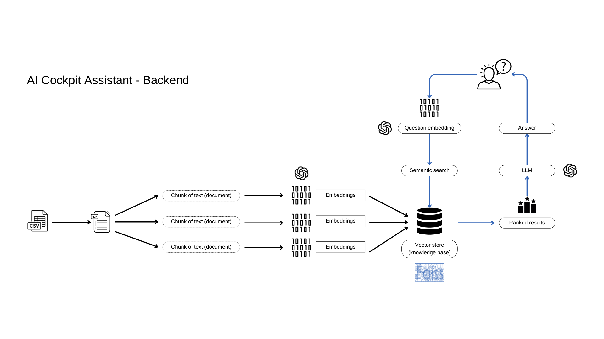

# Project 3 | AI Cockpit Assistant - Backend ([IPVC](https://www.ipvc.pt/) / [Tlantic](https://www.tlantic.com/pt/)) | Curricular Internship
* Teacher : [Jorge Ribeiro](mailto:jribeiro@estg.ipvc.pt)

## Overview
* This repository contains the backend implementation for an AI Cockpit Assistant, designed to support a data analysis tool. The assistant utilizes AI algorithms to respond to user queries, incorporating the ChatGPT API for model application. The backend is developed using  Python, Langchain, and leverages an API REST architecture.

## Features
* Data Integration: The backend seamlessly integrates with the Tlantic software to collect necessary data for analysis.

* AI-Powered Responses: Leveraging advanced AI algorithms, the assistant provides intelligent responses to user queries, enhancing the overall user experience.

* ChatGPT Integration: The application makes use of the ChatGPT API for deploying language models, enabling natural language interactions with the users.

## Technologies Used
* Python: Utilized for various backend functionalities, ensuring efficient data processing and integration.

* Langchain: Integrated for specific functionalities, enhancing the overall capabilities of the assistant.

* API REST: The backend exposes RESTful APIs for seamless communication with other components of the application.

* FAISS : Faiss is a library for efficient similarity search and clustering of dense vectors. It contains algorithms that search in sets of vectors of any size, up to ones that possibly do not fit in RAM. It also contains supporting code for evaluation and parameter tuning.


## How to I setup my development environment? 

* Install [Docker Desktop](https://www.docker.com/products/docker-desktop/)
* Create the necessary Docker Images and Containers by running the following command in the project's root folder:
```
docker-compose up --build -d
```
* *Note:* the **-d** flag intends to launch all the containers in background. If not used, all the containers will run attached to the same process.
* Once your are done working in the assignment, you can remove everything by running:
```
docker-compose down
```
* **NOTE:** once you run the command above, the data in the database will be reset if not stored in a volume. Consider stopping the container instead, if you want to keep the data.
```
# stops all the containers
docker-compose stop

# restarts all the containers 
docker-compose start
```

### Architecture ###

